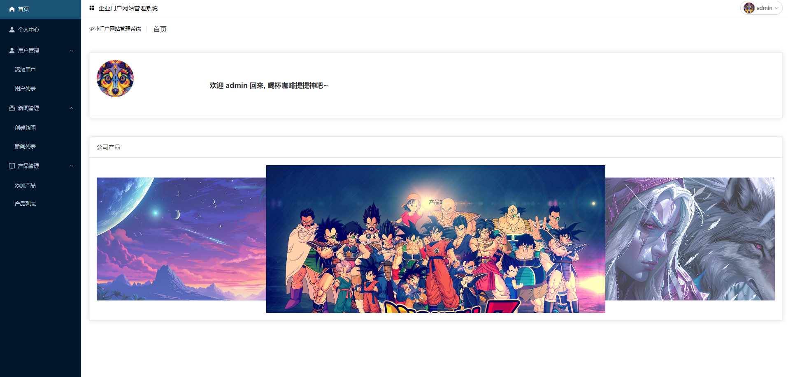

# vue3-node

vue3-node full stack project

## web-admin

vue3 + ts + elementplus + pinia 后台管理系统



```bash
npm i
npm run dev
```

## web-company

vue3 + ts + elementplus 门户网站


```bash
npm i
npm run dev
```

## web-server

nodeJS express 后台接口

演示需要连接本地 mongodb 数据库

```bash
npm i
npm start
```
